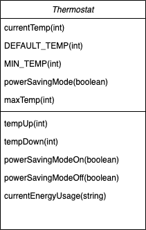

## Thermostat - JS

Week 5 Afternoon Challenge
Ryan and Paul

### Technologies
Production: Javascript
Testing: Jasmine 3.6.0

### Class Diagram



### User Stories
```
As a User
So I do not need to set the thermostat every time
I want the default temperature to be 20 degrees

As a User
So I can control the temperature
I want to be able to increase the temperature

As a User
So I can control the temperature
I want to be able to decrease the temperature

As a User
So I don't accidentally turn the temperature too low
I want a minimum temperature limit of 10 degrees

As a User
So I can control my power usage
I want the power saving mode to be on by default

As a User 
So the power saving mode saves energy
I want the maximum temperature to be 25 degrees when   power saving mode is on

As a User
So I can increase the temperature when it is really cold
If power saving mode is off, the maximum temperature is 32 degrees

As a User 
So I can reset the temperature easily
I want there to be a reset button

As a User
So I know how much energy I am using
I want to be able to ask what the current energy usage is

```

(In the challenges where we add an interface, low-usage will be indicated with green, medium-usage indicated with black, high-usage indicated with red.)

### Thermostat Interface

Displayed:
- currentTemp
- currentEnergyUsage

Buttons:
- tempUp
- tempDown
- resetTemp
- powerSavingModeOn
- powerSavingModeOff